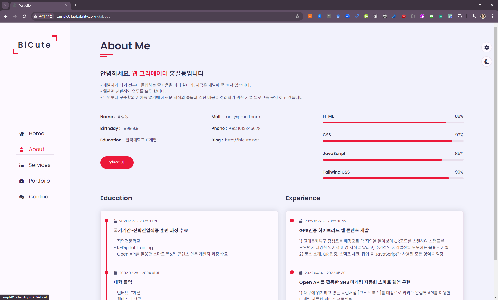
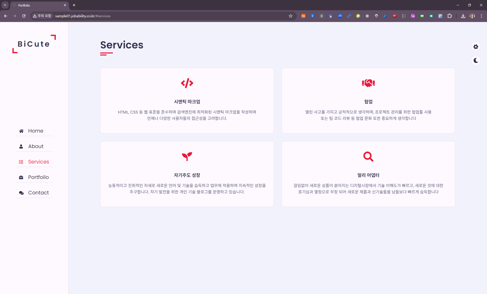

# sample01
Color값 변경 가능한 CSS선택으로 주컬러와 배경을 다르게 사용할 수 있는 개인 포트폴리오.

https://aebonlee.github.io/Portfolio02/

3D 거점 점령전 (King of the Hill)
중앙 거점을 차지하기 위해 경쟁하는 게임입니다. 키를 연타하여 상대를 거점 밖으로 밀어내고 혼자 거점을 차지하면 승리합니다.
Blue Player (파랑): 화살표 키
Red Player (빨강): wasd 키
Blue Player 점프 키: / 키
Red Player 점프 키: 좌shift 키